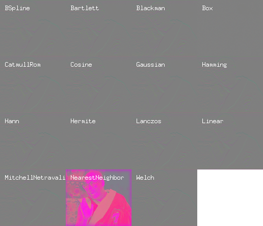

# imaging-resize

This is a small Go app that resizes an image with the [disintegration/imaging](https://github.com/disintegration/imaging) library to demonstrate its gamma behavior.

See Eric Brasseur's [Gamma error in picture scaling](http://www.ericbrasseur.org/gamma.html) for motivation.

## Usage

    bazel run //:imaging-resize -- $PWD/gamma_dalai_lama_gray.jpg $PWD/out.png
